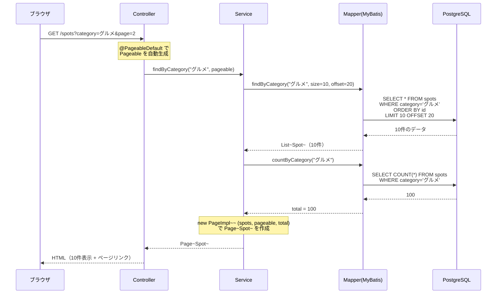
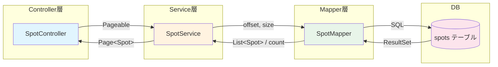
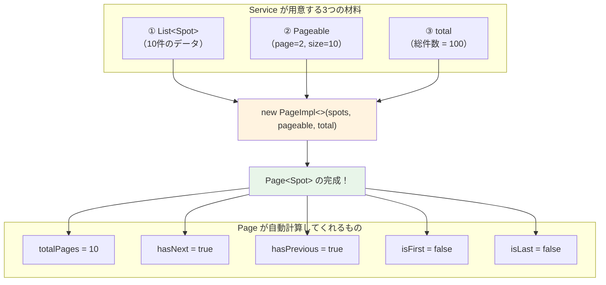

# ページネーション（Pageable / Page\<T>）ガイド

---

## 1. 全体像

ページネーションとは、大量のデータを「1ページ○件ずつ」に分割して表示する仕組みです。

```
例：spotsテーブルに100件のお店がある場合

ページ1: 1〜10件目
ページ2: 11〜20件目
ページ3: 21〜30件目
  ...
```

Spring が提供する `Pageable` と `Page<T>` を使うと、この処理を簡単に実装できます。

---

## 2. クラスの役割

| クラス        | 役割                                                 | ひとことで言うと           |
| ------------- | ---------------------------------------------------- | -------------------------- |
| `Pageable`    | 「何ページ目の、何件を取得するか」を持つ             | **リクエスト情報**         |
| `Page<T>`     | 「取得した結果 + 総件数 + 総ページ数」を持つ         | **レスポンス情報**         |
| `PageImpl<T>` | `Page<T>` の実装クラス。自分で結果を詰めるときに使う | **Pageを自作するための箱** |

### Pageable が持っている情報

```
pageable.getPageNumber()  → 現在のページ番号（0始まり！）
pageable.getPageSize()    → 1ページあたりの件数
pageable.getOffset()      → SQLの OFFSET 値（自動計算される）
```

> **注意:** ページ番号は **0始まり** です。URLで `?page=0` が1ページ目になります。

### Page\<T> が持っている情報

```
page.getContent()         → 現在ページのデータリスト
page.getTotalElements()   → 全データの総件数
page.getTotalPages()      → 総ページ数
page.getNumber()          → 現在のページ番号（0始まり）
page.getSize()            → 1ページあたりの件数
page.hasNext()            → 次のページがあるか
page.hasPrevious()        → 前のページがあるか
page.isFirst()            → 最初のページか
page.isLast()             → 最後のページか
```

---

## 3. 処理の流れ

### 3-1. シーケンス図（データの流れ）



### 3-2. クラス構成図



### 3-3. PageImpl 詰め替えのイメージ



**ポイント：MyBatis は `Page` を自動で作ってくれないので、Service で `PageImpl` に詰め替えます。**

---

## 4. サンプルコード

### 4-1. Entity（Spot.java）

```java
package com.example.tourism.entity;

public class Spot {
    private Long id;
    private String name;
    private String category;    // "グルメ", "観光", "ショッピング" など
    private String description;
    private String address;

    // getter / setter 省略（Lombokを使う場合は @Data でOK）
}
```

---

### 4-2. Mapper（SpotMapper.java）

MyBatis の Mapper では、**offset** と **size** を引数で受け取り、SQL に渡します。

```java
package com.example.tourism.mapper;

import com.example.tourism.entity.Spot;
import org.apache.ibatis.annotations.Mapper;
import org.apache.ibatis.annotations.Param;
import org.apache.ibatis.annotations.Select;

import java.util.List;

@Mapper
public interface SpotMapper {

    /**
     * カテゴリ別にスポットを取得（ページング用）
     * LIMIT と OFFSET で「何件目から何件取るか」を指定
     */
    @Select("SELECT * FROM spots "
          + "WHERE category = #{category} "
          + "ORDER BY id "
          + "LIMIT #{size} OFFSET #{offset}")
    List<Spot> findByCategory(@Param("category") String category,
                              @Param("size") int size,
                              @Param("offset") long offset);

    /**
     * カテゴリ別の総件数を取得（総ページ数の計算に必要）
     */
    @Select("SELECT COUNT(*) FROM spots WHERE category = #{category}")
    long countByCategory(@Param("category") String category);
}
```

> **XML で書く場合（SpotMapper.xml）：**
>
> ```xml
> <select id="findByCategory" resultType="com.example.tourism.entity.Spot">
>     SELECT * FROM spots
>     WHERE category = #{category}
>     ORDER BY id
>     LIMIT #{size} OFFSET #{offset}
> </select>
>
> <select id="countByCategory" resultType="long">
>     SELECT COUNT(*) FROM spots
>     WHERE category = #{category}
> </select>
> ```

---

### 4-3. Service（SpotService.java）⭐【重要】

**Pageable から offset と size を取り出して Mapper に渡し、結果を PageImpl に詰め替えます。**

```java
package com.example.tourism.service;

import com.example.tourism.entity.Spot;
import com.example.tourism.mapper.SpotMapper;
import org.springframework.data.domain.Page;
import org.springframework.data.domain.PageImpl;
import org.springframework.data.domain.Pageable;
import org.springframework.stereotype.Service;

import java.util.List;

@Service
public class SpotService {

    private final SpotMapper spotMapper;

    public SpotService(SpotMapper spotMapper) {
        this.spotMapper = spotMapper;
    }

    /**
     * カテゴリ別スポット一覧（ページング対応）
     */
    public Page<Spot> findByCategory(String category, Pageable pageable) {

        // ① Mapper でデータを取得（LIMIT + OFFSET）
        List<Spot> spots = spotMapper.findByCategory(
                category,
                pageable.getPageSize(),    // 1ページあたりの件数
                pageable.getOffset()       // 何件目から取るか
        );

        // ② 総件数を取得
        long total = spotMapper.countByCategory(category);

        // ③ PageImpl に詰めて返す（これだけ！）
        return new PageImpl<>(spots, pageable, total);
    }
}
```

**たったこの3ステップで `Page<Spot>` が完成します。**

---

### 4-4. Controller（SpotController.java）

```java
package com.example.tourism.controller;

import com.example.tourism.service.SpotService;
import org.springframework.data.domain.Pageable;
import org.springframework.data.web.PageableDefault;
import org.springframework.stereotype.Controller;
import org.springframework.ui.Model;
import org.springframework.web.bind.annotation.GetMapping;
import org.springframework.web.bind.annotation.RequestParam;

@Controller
public class SpotController {

    private final SpotService spotService;

    public SpotController(SpotService spotService) {
        this.spotService = spotService;
    }

    /**
     * カテゴリ別スポット一覧
     *
     * URL例:
     *   /spots?category=グルメ          → 1ページ目（10件）
     *   /spots?category=グルメ&page=2   → 3ページ目（0始まりなので）
     *   /spots?category=グルメ&page=0&size=5 → 1ページ目（5件ずつ）
     */
    @GetMapping("/spots")
    public String list(
            @RequestParam String category,
            @PageableDefault(size = 10) Pageable pageable,  // ← これだけでOK！
            Model model) {

        model.addAttribute("spots", spotService.findByCategory(category, pageable));
        model.addAttribute("category", category);

        return "spots/list";
    }
}
```

**`@PageableDefault(size = 10)` で、ページサイズの初期値を設定できます。**

---

### 4-5. Thymeleaf テンプレート（spots/list.html）

```html
<!DOCTYPE html>
<html xmlns:th="http://www.thymeleaf.org">
    <head>
        <meta charset="UTF-8" />
        <title th:text="${category} + ' のスポット一覧'">スポット一覧</title>
        <link
            rel="stylesheet"
            href="https://cdn.jsdelivr.net/npm/bootstrap@5.3.0/dist/css/bootstrap.min.css"
        />
    </head>
    <body>
        <div class="container mt-4">
            <h1 th:text="${category} + ' のスポット一覧'">スポット一覧</h1>

            <!-- ===== スポット一覧テーブル ===== -->
            <table class="table table-striped">
                <thead>
                    <tr>
                        <th>スポット名</th>
                        <th>説明</th>
                        <th>住所</th>
                    </tr>
                </thead>
                <tbody>
                    <tr th:each="spot : ${spots.content}">
                        <td th:text="${spot.name}">スポット名</td>
                        <td th:text="${spot.description}">説明</td>
                        <td th:text="${spot.address}">住所</td>
                    </tr>
                </tbody>
            </table>

            <!-- ===== ページネーション ===== -->
            <!-- spots は Page<Spot> なので、ページ情報が入っている -->
            <nav th:if="${spots.totalPages > 1}">
                <ul class="pagination justify-content-center">
                    <!-- 「前へ」ボタン -->
                    <li
                        class="page-item"
                        th:classappend="${spots.first} ? 'disabled'"
                    >
                        <a
                            class="page-link"
                            th:href="@{/spots(category=${category}, page=${spots.number - 1})}"
                            href="#"
                            >&laquo; 前へ</a
                        >
                    </li>

                    <!-- ページ番号 -->
                    <li
                        class="page-item"
                        th:each="i : ${#numbers.sequence(0, spots.totalPages - 1)}"
                        th:classappend="${i == spots.number} ? 'active'"
                    >
                        <a
                            class="page-link"
                            th:href="@{/spots(category=${category}, page=${i})}"
                            th:text="${i + 1}"
                            href="#"
                            >1</a
                        >
                    </li>

                    <!-- 「次へ」ボタン -->
                    <li
                        class="page-item"
                        th:classappend="${spots.last} ? 'disabled'"
                    >
                        <a
                            class="page-link"
                            th:href="@{/spots(category=${category}, page=${spots.number + 1})}"
                            href="#"
                            >次へ &raquo;</a
                        >
                    </li>
                </ul>
            </nav>

            <!-- 表示件数の情報 -->
            <p class="text-center text-muted">
                全 <span th:text="${spots.totalElements}">0</span> 件中
                <span th:text="${spots.number * spots.size + 1}">1</span> 〜
                <span
                    th:text="${spots.number * spots.size + spots.numberOfElements}"
                    >10</span
                >
                件を表示 （<span th:text="${spots.totalPages}">0</span> ページ中
                <span th:text="${spots.number + 1}">1</span> ページ目）
            </p>
        </div>
    </body>
</html>
```

---

## 5. 依存関係（build.gradle に追加が必要）

MyBatis で `Pageable` / `Page` を使うには、`spring-boot-starter-data-commons` が必要です。

```groovy
dependencies {
    // 既存のもの
    implementation 'org.springframework.boot:spring-boot-starter-web'
    implementation 'org.mybatis.spring.boot:mybatis-spring-boot-starter:3.0.3'
    runtimeOnly 'org.postgresql:postgresql'

    // ★ これを追加！（Pageable / Page を使うために必要）
    implementation 'org.springframework.boot:spring-boot-starter-data-commons'
}
```

> **Maven（pom.xml）の場合：**
>
> ```xml
> <dependency>
>     <groupId>org.springframework.boot</groupId>
>     <artifactId>spring-boot-starter-data-commons</artifactId>
> </dependency>
> ```

---

## 6. よくある疑問 Q&A

### Q1. ページ番号が 0 始まりなのが気になる…

URLでは `?page=0` が1ページ目です。Thymeleaf で表示するときに `+1` して見せれば、ユーザーには自然に見えます。

```html
<!-- ページ番号の表示は +1 する -->
<span th:text="${spots.number + 1}">1</span> ページ目
```

### Q2. 1ページあたりの件数を変えたいときは？

URLパラメータで `?size=5` のように指定できます。Controller 側の変更は不要です。

```
/spots?category=グルメ&page=0&size=5   → 5件ずつ表示
/spots?category=グルメ&page=0&size=20  → 20件ずつ表示
```

### Q3. ソート順を変えたいときは？

URLパラメータで `?sort=name,asc` のように指定できます。ただし MyBatis の場合、SQL に ORDER BY を自分で書く必要があるので、Pageable の sort 情報を SQL に反映する処理を追加する必要があります。最初は固定の ORDER BY（例: `ORDER BY id`）で十分です。

### Q4. データが0件のときは？

`Page` は空リストを返します。Thymeleaf 側で分岐しましょう。

```html
<div th:if="${spots.totalElements == 0}">
    <p>該当するスポットがありません。</p>
</div>
```

### Q5. 検索結果にもページネーションを使いたいときは？

同じパターンで Mapper にキーワード検索用メソッドを追加すればOKです。

```java
// Mapper
@Select("SELECT * FROM spots "
      + "WHERE name LIKE CONCAT('%', #{keyword}, '%') "
      + "ORDER BY id LIMIT #{size} OFFSET #{offset}")
List<Spot> searchByKeyword(@Param("keyword") String keyword,
                           @Param("size") int size,
                           @Param("offset") long offset);

@Select("SELECT COUNT(*) FROM spots "
      + "WHERE name LIKE CONCAT('%', #{keyword}, '%')")
long countByKeyword(@Param("keyword") String keyword);
```

---

## 7. まとめ：実装チェックリスト

- [ ] `build.gradle` に `spring-boot-starter-data-commons` を追加
- [ ] Mapper に **データ取得メソッド**（LIMIT / OFFSET 付き）を作成
- [ ] Mapper に **件数取得メソッド**（COUNT）を作成
- [ ] Service で `PageImpl` に詰め替え（3行の定型パターン）
- [ ] Controller の引数に `@PageableDefault Pageable pageable` を追加
- [ ] Thymeleaf で `spots.content` / `spots.totalPages` 等を使って表示
